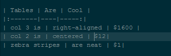

# MarkDown 使用说明书

## 标题
   在一行的开头添加`#`来表明其是标题，一级标题加一个，二级标题加两个，一次类推，直到六级标题
  > 但是，希望读者能偶在`#`与文字之间空一个空格
  
## 引用 
  > 在一行的开头添加一个`>`，但是要注意，如果直接换行，然后写子的话，那么这一行仍然是在 **引用** 的范围之内，若想跳出，则只需空一行就行

## 插入链接 
   语法结构是`[]()`，在`[]`中写入链接名称，在`()`中写入链接的地址 
   例如：  [百度](www.baidu.com)

## 插入图片 
   语法结构和 **插入链接** 比较类似，为：``，`[]`中写入图片描述，`()`写入图片URL地址 
   例如：  
  
## 粗体与斜体 
   粗体需要在文字两端加入`**`，将文字给包含起来  
   例如： 
   **我是粗体**  
   斜体需要在文字两端加入`*`，将文字给包含起来  

## 代码框 
   代码框的语法较为简单，只需要将代码用 
   ```
   `
   ```
   给包含起来 
   例如：  
```
   function learnMD() {
    ...
```
  
## 表格
   表格的语法较为复杂，但是却十分优美对于在命令行中使用过数据库的同学来说，这个还是比较简单的  
   其语法格式就是用`|`将每一行的每一列给隔开，但是在标题与下面的内容之间，在两个`|`之间需要填充`-`小短线，表格有多少列，那么就应该用`|`隔出多少列 
   例如： 

| Tables  | Are | Cool |
|---------|-----|-----:|
| col 3 is | right-aligned | $1600 |
| col 2 is | centered | $12|
| zebra stripes | are neat | $1| 

  图片：

  

  > 表格并不需要每一列的`|`对齐，至于每一列是左对齐、右对齐还是居中，则由标题行和内容行之间的分割线中是否有`:`和其位置有关
  若`|:------|`，则表示这一列左对齐
  若`|-------|`，则表示这一列居中显示
  若`|------:|`，则表示这一列右对齐
